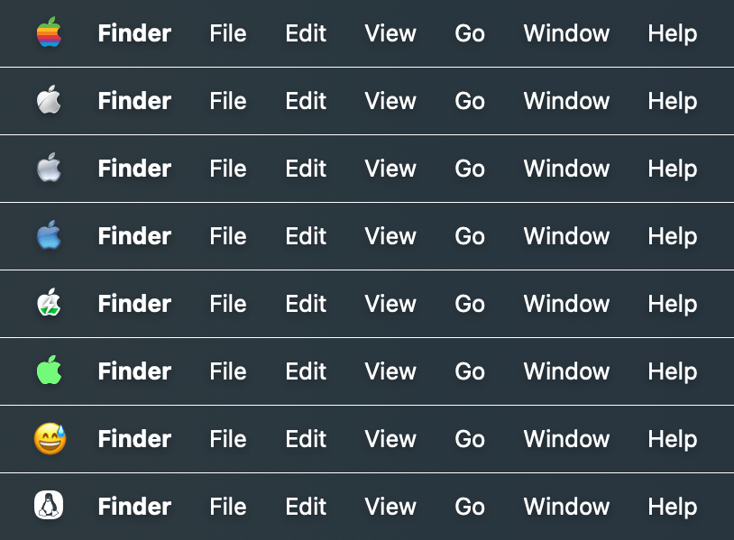

# 
<p align="center">

<h1 align="center">Logoer</h1>
<h3 align="center">Change the style of the Apple logo in macOS menu bar<br><a href="./README_zh.md">[中文版本]</a></h3> 
</p>

## Screenshots
<p align="center">


</p>

## Installation and Usage
### System Requirements:
- macOS 11.0 and Later  

### Installation:
Download the latest installation file [here](../../releases/latest) or install via Homebrew:  

```bash
brew install lihaoyun6/tap/logoer
```  

## Donate

