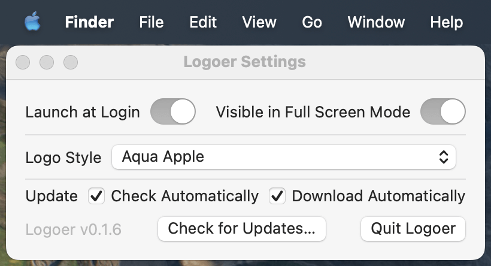

# 
<p align="center">

<h1 align="center">Logoer</h1>
<h3 align="center">更换macOS菜单栏苹果logo样式的小工具<br><a href="./README.md">[English Version]</a>
</p>

## 运行截图
<p align="center">


</p>

## 安装与使用
### 系统版本要求:
- macOS 11.0 及更高版本  

### 安装:
可[点此前往](../../releases/latest)下载最新版安装文件. 或使用homebrew安装:  

```bash
brew install lihaoyun6/tap/logoer
```

## 赞助

